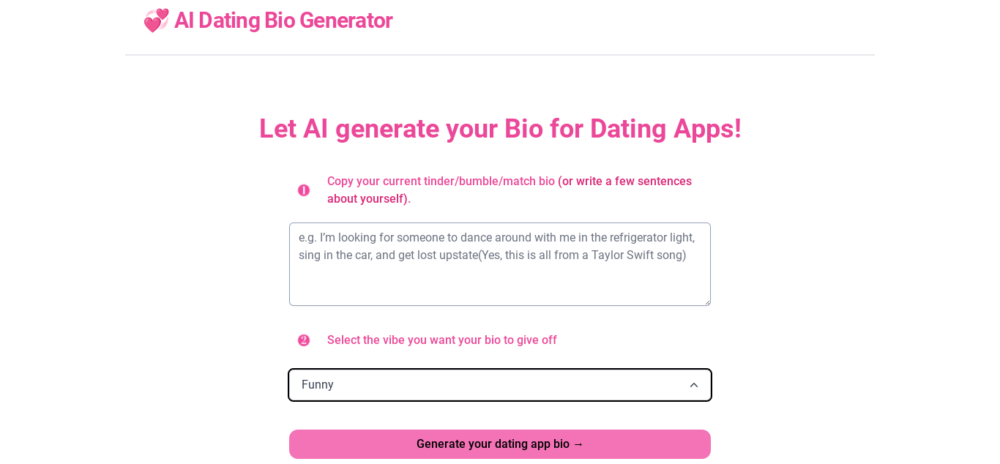

# [AI Dating App Bio Generator](https://aidatingbio.vercel.app/)

This project generates Dating app Bios for you using AI.

(https://aidatingbio.vercel.app/)

## How it works

This project is based off [twitterbio](https://github.com/Nutlope/twitterbio) it uses the [ChatGPT API](https://openai.com/api/) and [Vercel Edge functions](https://vercel.com/features/edge-functions) with streaming. It constructs a prompt based on the form and user input, sends it to the chatGPT API via a Vercel Edge function, then streams the response back to the application.

## Running Locally

After cloning the repo, go to [OpenAI](https://beta.openai.com/account/api-keys) to make an account and put your API key in a file called `.env`.

Then, run the application in the command line and it will be available at `http://localhost:3000`.

```bash
npm run dev
```

## One-Click Deploy

Deploy the example using [Vercel](https://vercel.com?utm_source=github&utm_medium=readme&utm_campaign=vercel-examples):

[](https://vercel.com/new/clone?repository-url=https://github.com/Nutlope/twitterbio&env=OPENAI_API_KEY&project-name=twitter-bio-generator&repo-name=twitterbio)
